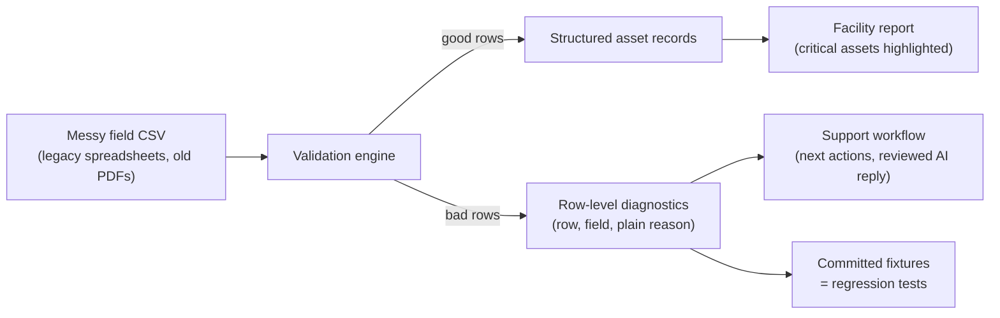
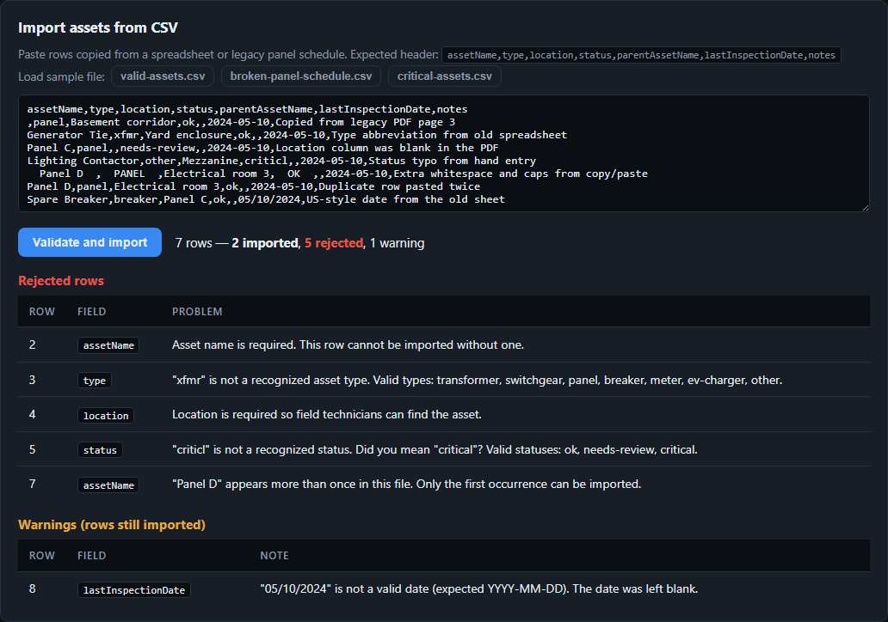

# FieldAsset QA Lab

[](https://github.com/ajcondondev/fieldasset-qa-lab/actions/workflows/ci.yml)

**Live demo: [ajcondondev.github.io/fieldasset-qa-lab](https://ajcondondev.github.io/fieldasset-qa-lab/)**. Nothing to install. The [2-minute walkthrough](#demo-walkthrough-2-minutes) below tells you what to click.

This is a small working app that shows how I would build QA from the ground up in an AI-enabled world. The scenario is based on electrical field data: a customer pastes a messy spreadsheet, and the app either imports each row or explains exactly why it failed.



My approach in one sentence:

> Use AI for speed: test ideas, edge cases, test data, and first drafts. Keep acceptance criteria, deterministic tests, and human judgment as the source of truth. AI drafts, humans decide.

This is a portfolio project. It is not affiliated with any company, and all the data is fictional.



*The core of the demo: a legacy panel schedule with seven different problems. Every row either imports or explains itself. Errors block the row, warnings don't, and typos get a suggestion.*

## What the app does

1. **Facility list.** Seeded facilities with status and critical-asset counts.
2. **Facility detail.** Asset table with inline status editing.
3. **CSV import.** Paste rows copied from a spreadsheet or an old PDF. Valid rows import. Invalid rows are listed with the row number, the field, and a reason written in plain language.
4. **Support diagnostics.** The last import's source, counts, suggested next actions, and an AI-assisted customer reply that cannot be copied until a human marks it reviewed.
5. **Report preview.** Critical and needs-review assets called out, missing inspection dates flagged, copy as text or download as JSON. Archived facilities never produce a report.

Three CSV files in `src/test-fixtures/` drive everything: a clean file, a broken customer-like file, and a critical-assets file. The same files power the sample buttons in the UI, the unit tests, and the Playwright tests. One source of truth for what "correct" means.

## Demo walkthrough (2 minutes)

1. Open the [live demo](https://ajcondondev.github.io/fieldasset-qa-lab/) (or run it locally, below).
2. Open **Granite Street Warehouse** and scroll to **Import assets from CSV**.
3. Click **Load sample file: broken-panel-schedule.csv**, then **Validate and import**.
4. Read the result: `7 rows, 2 imported, 5 rejected, 1 warning`. The rejected list shows a missing name, an unknown type (`xfmr`), a missing location, a typo (`criticl`, with a "did you mean critical?" hint), and a duplicated row. Note that the row with extra whitespace and capital letters was cleaned up and imported, and the US-format date imported with a warning instead of failing.
5. In **Support diagnostics**, click **Draft customer reply**. Try to copy it. You can't until you check "I reviewed this draft". That checkbox is the AI guardrail, and it has its own regression test.
6. Click **Generate report**. The critical switchgear you just imported is highlighted.

The broken file in step 3 is also the customer ticket in [docs/support-reproduction.md](docs/support-reproduction.md), which follows it from support report to root cause to the regression tests that now pin its behavior.

## How I build QA from the ground up

Quality gets designed in with the first user story, not added after the features are done:

```
user story → acceptance criteria → risk analysis → manual test charter
→ automated test → support reproduction path → bug report
→ regression coverage → release decision
```

What that looks like in this repo:

- **Acceptance criteria come before tests.** [docs/traceability.md](docs/traceability.md) maps every user story to its risk, its manual check, and its automated test by name.
- **Coverage follows risk.** The import parser is where a customer can silently lose data, so it gets the deepest unit coverage. UI workflows get Playwright tests. Visual polish gets manual charters instead of automation.
- **Tests are deterministic on purpose.** The parser is a pure function and the report builder takes the current time as a parameter. Same input, same output, no flaky tests.
- **Support tickets become tests.** A customer's broken file gets minimized into a fixture, committed, and pinned by tests so the behavior can never quietly change again.
- **Releases are a decision, not a checkmark.** [docs/release-checklist.md](docs/release-checklist.md) lists what has to pass and ends with a human sign-off.

## How AI fits in

Full write-up in [docs/ai-enabled-qa.md](docs/ai-enabled-qa.md). The short version:

| AI speeds up | A human owns |
|---|---|
| Brainstorming edge cases and test data | Which fixtures get committed and what "correct" means |
| Drafting test skeletons | Selectors, assertions, and expected outcomes |
| Summarizing logs and import errors | Confirming root cause before filing a bug |
| Drafting customer replies and bug reports | Reviewing tone and accuracy before anything is sent |
| Suggesting coverage gaps after a bug | Deciding what becomes permanent regression coverage |

The guardrail isn't just in the docs. In the app, the AI-drafted customer reply is locked until a human checks a review box, and a Playwright test makes sure that lock works. The repo itself was built with an AI coding agent under the same rules, documented in [CLAUDE.md](CLAUDE.md).

## Run it locally

```bash
npm install
npm run dev        # http://localhost:5173
```

No backend and no API keys. Data persists to localStorage, and the **Reset demo data** button restores the seed.

## Run the tests

```bash
npm run test:unit  # Vitest: 26 tests on the parser, report builder, and fixtures
npm run test:e2e   # Playwright: 14 workflow tests (first run: npx playwright install chromium)
npm test           # both
```

CI runs the build and both suites on every push. Every push to `main` also republishes the live demo.

## The docs

| Doc | What it covers |
|---|---|
| [docs/qa-strategy.md](docs/qa-strategy.md) | Product risks, test pyramid, manual charters, automation rules |
| [docs/ai-enabled-qa.md](docs/ai-enabled-qa.md) | The full AI-enabled QA operating model and its guardrails |
| [docs/support-reproduction.md](docs/support-reproduction.md) | A customer ticket followed to root cause and regression tests |
| [docs/bug-report-example.md](docs/bug-report-example.md) | What my engineering handoff looks like |
| [docs/release-checklist.md](docs/release-checklist.md) | What has to pass before shipping |
| [docs/traceability.md](docs/traceability.md) | Every story mapped to its risk and its tests |

## What this demonstrates

For a QA + Support Engineer role, this project shows that I can:

- Own quality from day one: acceptance criteria and a risk map first, tests second, with the gaps tracked honestly.
- Think like support: plain-language errors, suggested next actions, and a reply the customer can actually act on.
- Turn a customer's broken file into permanent regression coverage.
- Build automation that stays reliable: pure functions, committed fixtures, role-based locators, no sleeps.
- Use AI heavily and safely, with review gates that are themselves tested.
- Communicate clearly in bug reports, checklists, and docs written for the people who read them.

## What I would add next

- An import preview step, so customers can review and fix rows before anything is committed.
- A downloadable "rejected rows" CSV so customers can fix and re-import only the failures.
- A real LLM behind the reply drafter (bring your own key), keeping the same review gate.
- Accessibility checks and visual snapshots in CI, plus clipboard and download content assertions.
